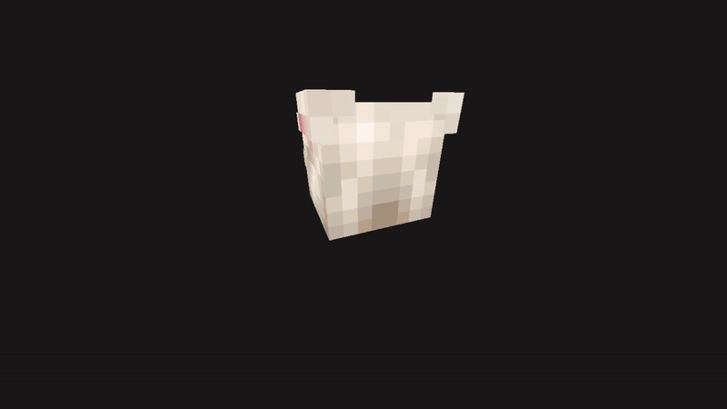

# Cabela simulator

### Simulate the amazing cabela for all your needs.

- Run it on the background for a amazing desktop.
- Have the swaggiest Screensaver ever
- Cabela




## How to build
(Linux only)

This project uses [nob.h](https://github.com/tsoding/nob.h).

Bootstrap the build system with:
```shell
cc nob.c -o nob
```

compile with:

```C
./nob
```

If you have `x86_64-w64-mingw32`, It will also be cross-compiled for Windows (x64) systems.
